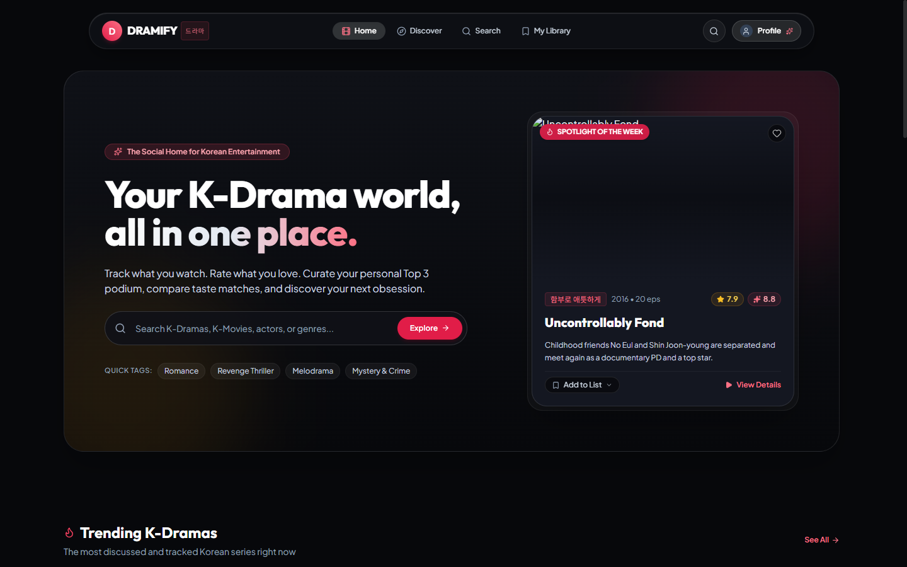
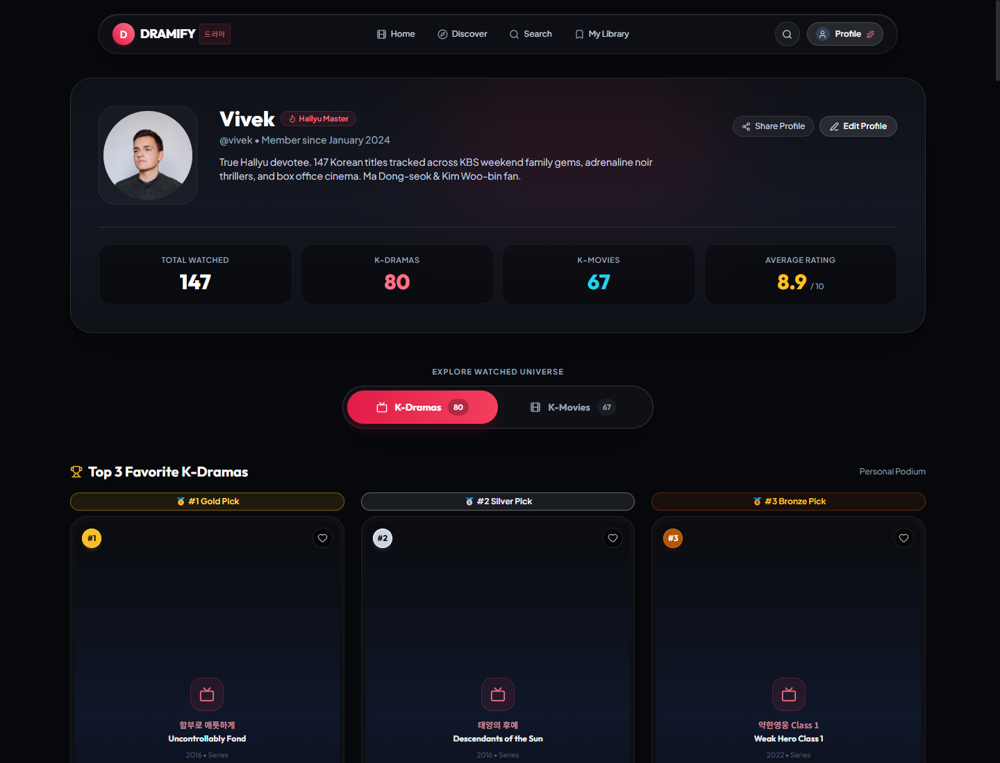
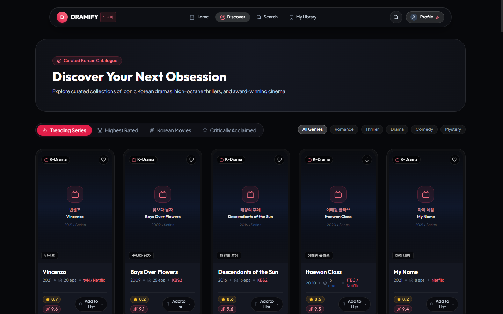

<div align="center">

# 🎬 Dramify (드라마)
### *The Premium Social Tracking & Discovery Platform for Korean Drama & Cinema*

[](LICENSE)
[](https://react.dev/)
[](https://www.typescriptlang.org/)
[](https://tailwindcss.com/)
[](https://nodejs.org/)
[](https://expressjs.com/)
[](https://www.mongodb.com/)
[](https://www.themoviedb.org/)

<p align="center">
  A bespoke, cinema-grade web platform engineered specifically for Hallyu fans, K-Drama bingers, and Korean movie connoisseurs. Dramify combines social tracking, dual rating comparison, personalized top-tier podiums, and curated discovery in an Obsidian Cinema design language.
</p>

</div>

---

## 🖼️ Application Showcase

### 1. Home & Cinematic Spotlight
> Atmospheric spotlight featuring trending releases, dual critic/community ratings, Hangul subtitles, and quick-add watchlist triggers.

<div align="center">
  
</div>

---

### 2. Devotee Profile & Sliding Pill Navigation
> Personal profile showcasing 147 cataloged Korean titles with a responsive sliding pill navbar to seamlessly toggle between **K-Dramas (83)** and **K-Movies (64)**, accompanied by a dynamic Top 3 podium.

<div align="center">
  
</div>

---

### 3. Curated Korean Catalogue & Discovery
> Filterable browsing feed segmented by trending series, all-time highest rated, blockbuster films, and critical gems.

<div align="center">
  
</div>

---

## ✨ Core Highlights & Features

### 🎚️ Interactive Sliding Pill View Toggle
- Effortlessly slide between **📺 K-Dramas** and **🎬 K-Movies** in your profile with a fluid, glowing indicator.
- Real-time filtered grid featuring custom search by English or Hangul title, and 4-way sorting (*List Order #1–#147, Highest Rated, Release Year, and Alphabetical*).

### 🏆 Dynamic Top 3 Podium
- Interactive personal podium displaying 🥇 Gold, 🥈 Silver, and 🥉 Bronze favorites.
- Automatically switches between your highest-rated **K-Dramas** and **K-Movies** when toggling the sliding pill.

### 📚 147 Watched Titles Library
- Deeply cataloged library of 147 iconic Korean titles (83 dramas and 64 movies) including English names, authentic Hangul typography, release years, and genres.
- Full tracking states: *Watching*, *Watched*, *Plan to Watch*, and *Favorites*.

### 🖼️ Resilient Fallback Poster System
- Intelligent image error handling: whenever an external CDN poster is missing or blocked, the card renders an editorial Korean poster with authentic Hangul typography, media category badge, release year, and subtle cinematic patterns.
- No broken image icons or blank grey placeholders.

### ⭐ Dual Rating Showcase
- Compare official **TMDB Critic Scores** alongside **Dramify Community Ratings**.
- Submit personal 1–10 star ratings with written reviews and community reactions.

---

## 🏗️ Architecture & Project Structure

The project follows a clean decoupled monorepo architecture:

```
dramify/
├── client/                      # Frontend Single Page Application
│   ├── src/
│   │   ├── components/          # Reusable UI components (MediaCard, RatingBadge, Navbar)
│   │   ├── pages/               # Route views (HomePage, ProfilePage, DiscoverPage, etc.)
│   │   ├── data/                # 147 watched Korean titles & mock seed data
│   │   ├── types/               # TypeScript interfaces (Media, User, Reviews)
│   │   └── services/            # API client service for backend communication
│   ├── tailwind.config.js       # Obsidian Cinema color palette & animations
│   └── vite.config.ts           # Vite 8 build configuration
│
├── server/                      # Backend API Server
│   ├── src/
│   │   ├── models/              # Mongoose schemas (User, MediaInteraction, Review)
│   │   ├── routes/              # Express API route controllers (auth, tmdb, interactions)
│   │   ├── services/            # Secure TMDB Korean proxy service
│   │   └── middleware/          # JWT authentication middleware
│   └── tsconfig.json            # Node/TypeScript server compilation
│
└── docs/
    └── screenshots/             # High-resolution application preview captures
```

---

## 🎨 Design Philosophy: *Obsidian Cinema*

- **Color Harmony**: Deep OLED background (`#07080B`), Obsidian surface (`#0F1117`), Crimson Rose highlight (`#E11D48`), Amber Star Gold (`#F59E0B`), and Cyan Movie Accent (`#06B6D4`).
- **Typography**: Modern geometric display type paired with crisp Korean Hangul font rendering.
- **Double-Bezel Elevation**: Concentric borders with subtle backdrops creating a tactile, cinema-grade feel.

---

## 📄 License

This project is open-source and licensed under the [MIT License](LICENSE).
